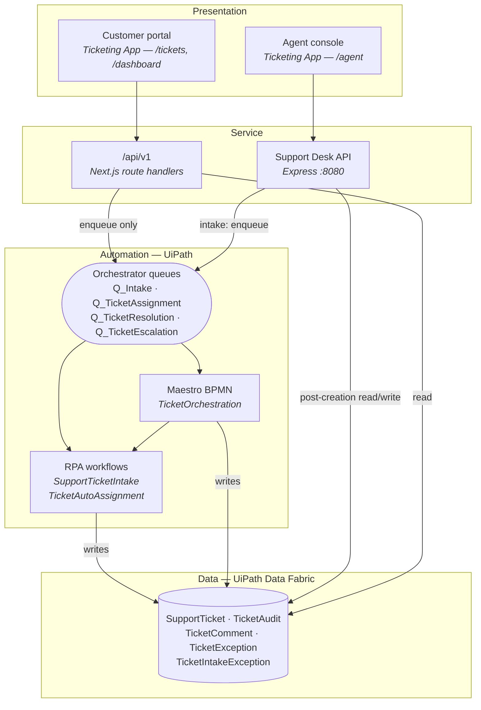

# Support Ticket Automation

An end-to-end support-ticket platform built on **UiPath**: a customer portal and agent
console, a stateless API that fronts UiPath, and an automation layer of RPA workflows, a
Maestro BPMN orchestration and Data Fabric as the system of record.

The tickets live in UiPath Data Fabric, and new tickets are
written only by a robot. Every layer below is arranged around that one constraint.

Next.js 16 · React 19 · TypeScript · Express · UiPath Orchestrator · Maestro · Data Fabric

---

## Repository layout

| Path | What it is | In scope |
|---|---|---|
| **`Ticketing App/`** | Next.js 16 customer portal + agent console, and the `/api/v1` integration API | ✅ submission |
| **`SupportDeskApi/`** | Express/TypeScript back-office API — JWT auth, SLA engine, refunds, intake-exception replay | ✅ submission |
| `src/`, `prisma/`, `public/`, `dev.db` | **Purity storefront** — a separate e-commerce project that shares this repository. Not part of this submission. | ❌ unrelated |

> If you are evaluating this project, everything that matters is in **`Ticketing App/`** and
> **`SupportDeskApi/`**. The storefront at the repository root is unrelated work that happens
> to live in the same repo.

---

## 1. Architecture overview

Four layers. The arrows that matter are the ones that *write*.



### The governing rule: one writer for ticket creation

A new ticket is **never** inserted by application code. `POST /api/v1/tickets` validates the
request, drafts a ticket id and puts an item on the intake queue — then returns **`202
Accepted`**, not `201`, because the record does not exist yet. The `SupportTicketIntake` robot
reads the queue item and writes the Data Fabric row with `Status = "Not Assigned"`.

This is deliberate, and it costs something: `GET /api/v1/tickets/{id}` returns `404` for a
second or two after submission. What it buys is that validation, duplicate detection and the
status guarantee live in exactly one place, and a Data Fabric outage queues work instead of
dropping it.

The same reasoning shapes updates. `PATCH /api/v1/tickets/{id}` does not mutate anything — it
pushes a command onto the queue that owns that part of the lifecycle and returns `202` with
the *current* ticket attached. Returning an optimistically-updated ticket would claim a change
that has not happened yet.

`SupportDeskApi` follows the same rule for intake, then writes directly to Data Fabric for
everything after creation — an agent typing a reply expects it to appear immediately.

---

## 2. Layer interactions

### Ticket creation — the full path

```
Customer submits the form
  └─ POST /api/v1/tickets                          Ticketing App/src/app/api/v1/tickets/route.ts
       ├─ validate subject, description, categoryId, departmentId   → 422 on failure
       ├─ draftTicket()  mints TCK-<base36>        src/lib/server/ticket-repository.ts
       └─ queueTicketIntake()                      src/lib/server/orchestration.ts
            └─ AddQueueItem → Q_Intake             (X-UIPATH-OrganizationUnitId: folder)
                 └─ Queue Trigger fires
                      └─ SupportTicketIntake robot
                           ├─ insert SupportTicket  Status = "Not Assigned"
                           └─ insert TicketAudit    Action = "Created"
  ← 202 Accepted { ticketId, queued: true, persisted: false }
```

### Orchestration — the START PROCESS action

`POST /api/v1/tickets/{id}/start-process` hands the ticket to Maestro via the intake queue.
The BPMN then owns the decision-making:

`Ticket submitted → Validate Ticket → Valid? ─┬─ invalid → Record Ticket Exception → Rejected`
`                                             └─ valid → Triage Ticket → Priority Decision ─┬─ High/Urgent → Path A: Escalate`
`                                                                                           └─ Normal → Path B: Standard SLA`
`                                             → Merge → Run Assignment Automation → Update Ticket Status → Send Notification → Ticket orchestrated`

The API refuses to re-triage a `resolved` or `closed` ticket (`409`) — doing so would reopen it
behind the user's back.

### Reads

| Concern | Path | Notes |
|---|---|---|
| Ticket list | `GET /api/v1/tickets` | Data Fabric filters are exact-match only, so text search and sorting are applied in memory over one bounded fetch (`MAX_FETCH = 1000`); the response carries `truncated` when that ceiling bites |
| Single ticket | `GET /api/v1/tickets/{id}` | Looked up by the app-facing `TicketId`, not the Data Fabric GUID |
| Activity timeline | `GET /api/v1/tickets/{id}/activity` | Read from `TicketAudit`. A row whose `PerformedBy` lacks an `@` is attributed to automation, so the timeline distinguishes robot actions from human ones |
| Dashboard | `GET /api/v1/dashboard/stats` | Response time and CSAT report `0` rather than an estimate — the entity does not record them, and a fabricated average is worse than an honest zero |
| Reference data | `GET /api/v1/meta` | Categories, departments, agents, valid statuses and priorities |
| Liveness | `GET /api/v1/health` | Includes `uipathConfigured` |

### Two services, two credential models

This is the one asymmetry worth understanding:

| | `Ticketing App` `/api/v1` | `SupportDeskApi` |
|---|---|---|
| Auth to UiPath | **Personal Access Token** (`UIPATH_SECRET`) | **External Application**, client credentials |
| Why | Data Fabric keeps its own role store. A PAT carries a *user* identity that already holds entity permissions | Correct for a service; requires a role granted inside Data Fabric, not just OAuth scopes |
| Consumer auth | none (portal is public) | JWT, HS256-pinned, issuer + audience verified, role-gated |

An External Application can mint a perfectly-scoped token and still be told *"You don't have
permission to access the entity, field or record"* — because scopes alone do not grant Data
Fabric roles. That is documented at `Ticketing App/src/lib/server/data-fabric.ts:1-12`.

---

## 3. UiPath assets

Tenant `sepiaecnvnwd` / `DefaultTenant`, folder **`Shared`** (id `7626318`).

### Published automations

| Name | Package | Version | Type |
|---|---|---|---|
| `SupportTicketIntake` | `SupportTicketIntake` | 1.0.1 | Process — queue-triggered performer on `Q_Intake` |
| `TicketAutoAssignment` | `TicketAutoAssignment` | 1.0.1 | Process — routes by category/priority, writes `Assignee` + `Status`, records audit |
| `TicketOrchestration` | `SupportTicketAutomation.agentic.TicketOrchestration` | 1.1.0 | **Maestro BPMN** — ProcessOrchestration |
| `TicketDataFabricRpa` | `TicketDataFabricRpa` | 1.0.0 | Process — Data Fabric write helper |

### Queues

`Q_Intake` (live consumer) · `Q_TicketIntake` · `Q_TicketAssignment` · `Q_TicketResolution` ·
`Q_TicketEscalation` — all with `EnforceUniqueReference = true`.

Because unique-reference is enforced, a command reference is unique *per command*, not per
ticket (`TCK-123:ASSIGN:<base36>`) — the same ticket is legitimately assigned, resolved and
escalated over its life.

### Data Fabric entities

| Entity | Fields | Role |
|---|---|---|
| `SupportTicket` | 53 | System of record. Written by the intake robot, extended with commerce/refund fields |
| `TicketAudit` | 15 | Append-only trail; every workflow writes a row on each state change |
| `TicketComment` | 15 | Customer thread and internal notes (server-side filtered) |
| `TicketException` | 17 | Workflow-level faults |
| `TicketIntakeException` | 20 | Failed submissions, captured with raw payload so they can be replayed |
| `SystemUser` | 7 | Agent directory |
| `Ticket` | 23 | Superseded prototype entity, retained only for reference |

The BPMN model is committed at
[`Ticketing App/docs/bpmn/support-ticket-orchestration.bpmn`](Ticketing%20App/docs/bpmn/support-ticket-orchestration.bpmn)
(a BPMN 2.0 documentation model — open it at [demo.bpmn.io](https://demo.bpmn.io)). The
*executable* Maestro definition is the one published in the tenant as
`SupportTicketAutomation.agentic.TicketOrchestration:1.1.0`.

---

## 4. Setup

### Prerequisites

- **Node.js 20+** (22 recommended — both Dockerfiles use `node:22-alpine`)
- A **UiPath Automation Cloud** tenant with:
  - the Data Fabric entities in the table above
  - the five queues, with a Queue Trigger on `Q_Intake` bound to `SupportTicketIntake`
  - `SupportTicketIntake` and `TicketAutoAssignment` published to a folder
- A **Personal Access Token** with `OR.Queues` and folder access (for `Ticketing App`)
- An **External Application**, confidential, with application scopes (for `SupportDeskApi`):
  `OR.Queues.Read OR.Queues.Write OR.Folders.Read OR.Assets.Read DataService.Data.Read
  DataService.Data.Write DataService.Schema.Read`

> The External Application's identity must also be granted a **role inside Data Fabric**.
> Scopes alone are not sufficient and the failure looks like a permissions error, not a
> configuration one.

### Ticketing App

```bash
cd "Ticketing App"
npm install
cp .env.example .env.local
```

Fill in `.env.local`:

| Variable | Meaning |
|---|---|
| `UIPATH_ORG` | First path segment of your cloud URL |
| `UIPATH_TENANT` | Admin → Tenants |
| `UIPATH_SECRET` | Personal Access Token — server-only, never prefixed `NEXT_PUBLIC_` |
| `UIPATH_FOLDER_ID` | Numeric folder id that owns the queue |
| `UIPATH_QUEUE_NAME` | Defaults to `Q_Intake` |
| `TICKET_INTAKE_QUEUE` | Defaults to `Q_Intake`; switch to `Q_TicketIntake` once a consumer is bound to it |
| `DATA_FABRIC_API_SEGMENT` | Defaults to `datafabric_/api`; some tenants answer on `dataservice_/api` |
| `NEXT_PUBLIC_SUPPORT_DESK_API_URL` | Where the agent console finds the Express API |

Verify connectivity before running the app:

```bash
npm run uipath:check
```

This validates the token and tenant, lists every folder you can reach (marking the one matching
`UIPATH_FOLDER_ID`), and confirms the queue exists. It never prints the secret — only its
length. If the token is unconfigured the app still boots; ticket creation simply reports
`uipath.skipped`.

### Support Desk API

```bash
cd SupportDeskApi
npm install
cp .env.example .env      # fill UIPATH_CLIENT_ID / UIPATH_CLIENT_SECRET / JWT_SECRET
npm run build
```

`config/env.ts` is zod-validated and **refuses to boot on bad configuration** rather than
failing later at the first request. `JWT_SECRET` must be at least 32 characters.

---

## 5. Run

### Development

```bash
# terminal 1 — Support Desk API on :8080
cd SupportDeskApi && npm run dev

# terminal 2 — portal + console on :3000
cd "Ticketing App" && npm run dev
```

| URL | Page |
|---|---|
| `http://localhost:3000` | Marketing page |
| `http://localhost:3000/tickets/new` | Submit a ticket — this is the demo path |
| `http://localhost:3000/dashboard` | Customer dashboard |
| `http://localhost:3000/agent` | Agent console (needs the Express API) |
| `http://localhost:8080/api/health/upstream` | Proves token + Orchestrator + all entities |

The customer portal runs standalone. Only `/agent` requires `SupportDeskApi`.

Get an agent token for the console:

```bash
curl -X POST localhost:8080/api/auth/dev-token \
  -H 'content-type: application/json' \
  -d '{"subject":"amara@brand.com","name":"Amara Nwosu","roles":["supervisor"]}'
```

This route is disabled when `NODE_ENV=production`.

### Verify the loop end to end

```bash
curl -X POST localhost:3000/api/v1/tickets -H 'content-type: application/json' -d '{
  "subject":"Order arrived damaged",
  "description":"The bottle was cracked in transit.",
  "categoryId":"cat-general","departmentId":"dept-support",
  "priority":"high","requesterEmail":"you@example.com"
}'
```

Expect `202`. Then watch the ticket appear: Orchestrator → `Q_Intake` gains an item →
`SupportTicketIntake` job runs → a new `SupportTicket` row exists →
`GET /api/v1/tickets/{ticketId}` stops returning `404`.

### Production

```bash
cd "Ticketing App"
npm run build && npm start   # next.config.ts sets output: "standalone"
npm run dist                 # self-contained folder → run with: node dist/server.js
docker build -t ticketing-app .   # multi-stage, non-root, listens on :3000
```

```bash
cd SupportDeskApi
npm run build && npm start   # :8080
```

---

## 6. Bonus features attempted

Beyond the core intake → store → assign loop:

**Maestro BPMN orchestration.** A published `ProcessOrchestration` package that owns validation,
triage, a priority branch (escalate vs. standard SLA), the assignment call and status write-back —
rather than encoding that logic in a single linear workflow.

**Agent console.** A seven-page back office at `/agent`: work queue with faceted filters, ticket
workspace with threaded comments, dashboards, an exceptions view and a batch-report view.

**Intake-exception capture and replay.** Failed submissions land in `TicketIntakeException` with
their raw payload; a supervisor can re-queue them with
`POST /api/intake-exceptions/:id/replay`. Failures are recoverable rather than lost.

**Refund state machine.** `None → Requested → Approved → Processed`, with `Rejected` appealable
back to `Requested`. Independent of ticket status, and approving money requires the `supervisor`
role.

**SLA engine.** Policies planned per priority, and **breach evaluated on read** rather than
trusted from a stored flag — so a ticket that went overdue overnight reports correctly instead of
waiting for a sweep job.

**Batch-code rollup.** `GET /api/metrics/batches` aggregates tickets by product batch — the
recall / adverse-event view. `Health & Safety` tickets are refused without a `batchCode`, because
an untraceable adverse-event report cannot be investigated.

**Category-driven priority floors.** `Health & Safety` forces `Urgent` and `Authenticity` forces
`High`, regardless of what the customer selected — and the response says the priority was raised
and why.

**Assisted intake.** The create-ticket form suggests a category, surfaces likely duplicates and
offers a canned solution before submission.
⚠️ **These are keyword-and-token-overlap heuristics, not a language model** — the implementation
is `Ticketing App/src/lib/api/ai-mock.ts` and the naming is deliberate. The UiPath docs in
`Ticketing App/docs/` describe where a real GenAI step would attach.

**Security posture** (Support Desk API). JWT pinned to HS256 so an `alg: none` token is rejected;
two DTO projections so customers never receive the agent-facing shape; internal notes filtered in
the query rather than the client; a wrong customer email returns the *same* `404` as a missing
ticket, so a ticket id alone reveals nothing; secrets redacted in logs; helmet, CORS allowlist,
256 kb body cap, per-IP intake rate limit; graceful shutdown so a rolling deploy cannot abort a
submission after the queue item was created but before the response was sent.

**Deployment artifacts.** Three build paths, for three different targets:

- a multi-stage Dockerfile running as a non-root user on `node:22-alpine`;
- `npm run dist` → `scripts/assemble-dist.mjs`, which folds Next's `output: "standalone"` server
  together with the static and public assets it does *not* bundle, producing a self-contained
  folder you run with `node dist/server.js`;
- a fully static export, which is what was packaged and published to the tenant as the
  `purityticketingapp` WebApp package — its `content/index.html` is byte-identical to the local
  static build.

---

## 7. Current state

Verified against the live tenant on 2026-07-27:

| Component | State |
|---|---|
| `SupportTicketIntake` | **59 job executions, all Successful** — runs on a schedule and on queue trigger |
| `TicketOrchestration` 1.1.0 | **One Completed instance** (`TicketOrchestration-708406374`). Earlier versions 1.0.0–1.0.7 faulted; 1.1.0 is the working definition |
| `TicketAutoAssignment` | 2 Successful, 1 Faulted |
| `SupportTicket` | 9 live records written by the robot, end to end from the portal |
| `TicketAudit` | 2 records |
| `TicketDataFabricRpa` | Published and deployed, **no executions yet** |
| `TicketComment`, `TicketException` | Schemas defined, **not yet populated** — the comment and exception paths run through `SupportDeskApi` against `TicketIntakeException` |

Status changes are handled by the **`Update Ticket Status`** task inside the Maestro BPMN rather
than by a separate `StatusManager` workflow — the orchestration owns the lifecycle, so a standalone
status process would be a second writer for the same field.

Workflow source is not in this repository: `SupportTicketIntake`, `TicketAutoAssignment` and
`TicketDataFabricRpa` were authored in **Studio Web**, and their published packages contain
compiled .NET assemblies rather than `.xaml`. The packages are downloadable from the Orchestrator
feed:

```bash
uip or packages download "SupportTicketIntake:1.0.1" -d SupportTicketIntake_1.0.1.nupkg
```

---

## 8. Documentation

| Document | Contents |
|---|---|
| [`Ticketing App/docs/orchestration-engine-architecture.md`](Ticketing%20App/docs/orchestration-engine-architecture.md) | 17-section architecture reference — process architecture, workflow hierarchy, queue design, REFramework structure, exception and logging frameworks, scalability. Includes 8 diagrams |
| [`Ticketing App/docs/studio-web-workflow.md`](Ticketing%20App/docs/studio-web-workflow.md) | Building the orchestration engine in Studio Web, step by step |
| [`Ticketing App/docs/studio-web-intake-build.md`](Ticketing%20App/docs/studio-web-intake-build.md) | Focused build guide for the intake workflow |
| [`Ticketing App/docs/uipath-integration.md`](Ticketing%20App/docs/uipath-integration.md) | REST API reference, tunnelling for robot access, HTTP Request activity configuration |
| [`Ticketing App/docs/uipath-rpa-workflow.md`](Ticketing%20App/docs/uipath-rpa-workflow.md) | Data Fabric write path and entity setup |
| [`Ticketing App/docs/bpmn/README.md`](Ticketing%20App/docs/bpmn/README.md) | BPMN model, executor legend, RPA integration points |
| [`SupportDeskApi/README.md`](SupportDeskApi/README.md) | Full API surface, domain rules, error contract, security posture |
