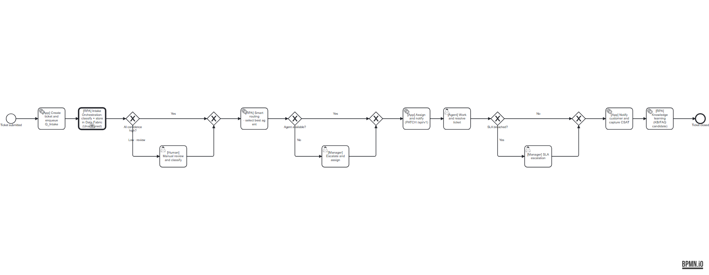

# Support Ticket Orchestration — BPMN process

A standard **BPMN 2.0** model of the end-to-end support-ticket business process,
with the **UiPath RPA workflow embedded as steps** inside it.

- Model file: [`support-ticket-orchestration.bpmn`](./support-ticket-orchestration.bpmn) — valid BPMN 2.0 (validated with `bpmn-moddle`, includes layout/DI).
- Preview: 

## How to open / use it

- **View/edit:** drag the `.bpmn` file onto <https://demo.bpmn.io>, or open it in
  **Camunda Modeler**.
- **Run it as orchestration:** import the `.bpmn` into **UiPath Maestro**
  (Agentic Orchestration). Maestro executes BPMN 2.0 and lets each step call an
  automation, an agent, an API workflow, or a human task.

## The flow

```mermaid
flowchart LR
  S([Ticket submitted]) --> A["#91;App#93; Create ticket + enqueue Q_Intake"]
  A --> R1["#91;RPA#93; Intake Orchestration:<br/>classify + store in Data Fabric (Unassigned)"]
  R1 --> G1{AI confidence high?}
  G1 -- Low --> M["#91;Human#93; Manual review + classify"] --> J1{ }
  G1 -- Yes --> J1
  J1 --> R2["#91;RPA#93; Smart routing — select agent"]
  R2 --> G2{Agent available?}
  G2 -- No --> E["#91;Manager#93; Escalate + assign"] --> J2{ }
  G2 -- Yes --> J2
  J2 --> AN["#91;App#93; Assign + notify (PATCH /api/v1)"]
  AN --> W["#91;Agent#93; Work + resolve ticket"]
  W --> G3{SLA breached?}
  G3 -- Yes --> SE["#91;Manager#93; SLA escalation"] --> J3{ }
  G3 -- No --> J3
  J3 --> N["#91;App#93; Notify customer + CSAT"]
  N --> K["#91;RPA#93; Knowledge learning (KB/FAQ)"]
  K --> C([Ticket closed])
```

## How it's integrated with the RPA workflow

Each step is tagged with its executor. The **`[RPA]`** steps are the UiPath
automations — the BPMN process *orchestrates* them:

| BPMN step | Type | Integration |
| --- | --- | --- |
| `[App] Create ticket + enqueue Q_Intake` | Service task | The app's `POST /api/v1/tickets` → `triggerTicketWorkflow()` adds the `Q_Intake` item. **This is the trigger that starts the RPA side.** |
| **`[RPA] Intake Orchestration`** | **Call activity** | The published Studio Web process (queue-triggered from `Q_Intake`) — classifies, **stores the ticket in Data Fabric marked Unassigned**, scores priority. This is the exact workflow from [`../studio-web-workflow.md`](../studio-web-workflow.md). |
| `[RPA] Smart routing` | Service task | UiPath automation selects the best agent (Data Service query). |
| `[App] Assign + notify` | Service task | Automation writes the decision back via `PATCH /api/v1/tickets/{id}` so the UI updates. |
| `[Human] / [Manager] / [Agent]` steps | User tasks | People — surfaced via UiPath **Action Center** tasks. |
| `[RPA] Knowledge learning` | Service task | Post-closure automation proposes KB/FAQ candidates. |

So the BPMN is the **business process layer**, and the RPA workflow is one (key)
automated activity inside it — specifically the `Q_Intake`-triggered process that
already fires when a ticket is submitted from the app.

## Executor legend

- **`[App]`** — the Purity Next.js app / `/api/v1` (this repo).
- **`[RPA]`** — UiPath automations (Studio Web processes / Orchestrator).
- **`[Human] / [Agent] / [Manager]`** — people, via Action Center tasks.

## Regenerating the model

The `.bpmn` was generated + auto-laid-out + validated with `bpmn-auto-layout`
and `bpmn-moddle`. To change the flow, edit it directly in demo.bpmn.io /
Camunda Modeler, or re-run the generator in the scratchpad build script.
