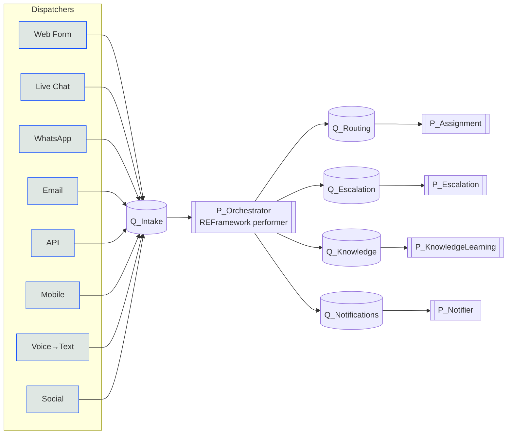
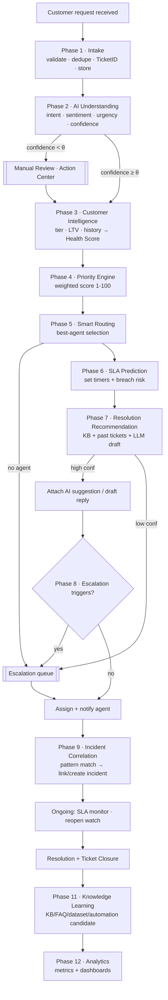
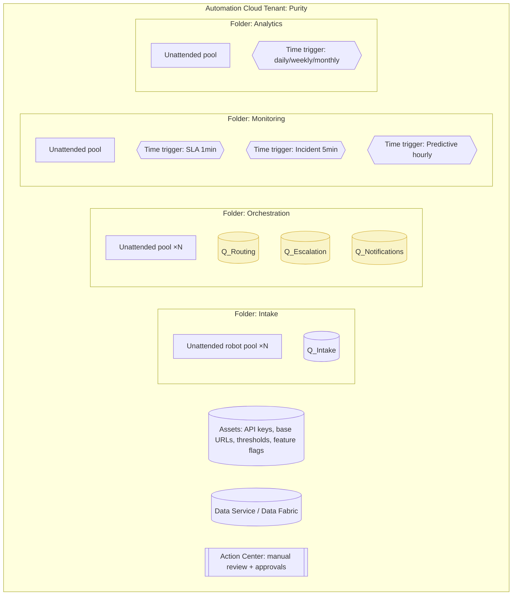
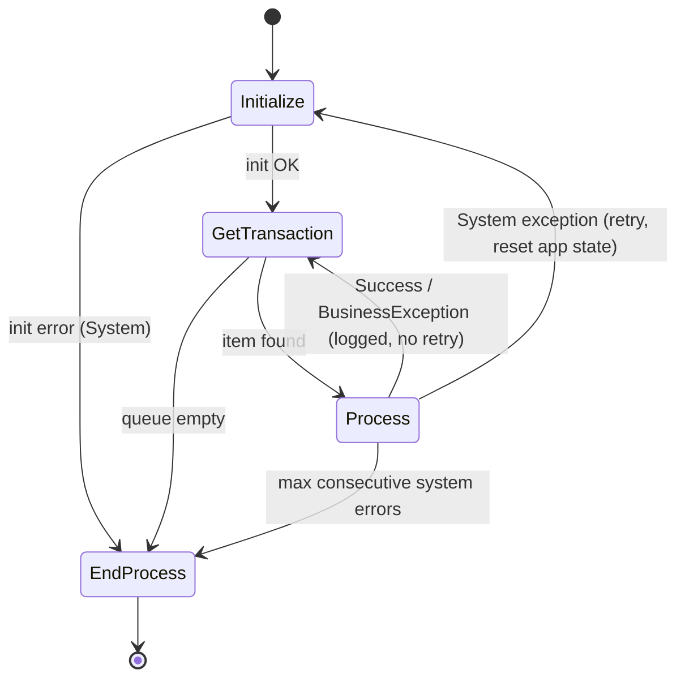
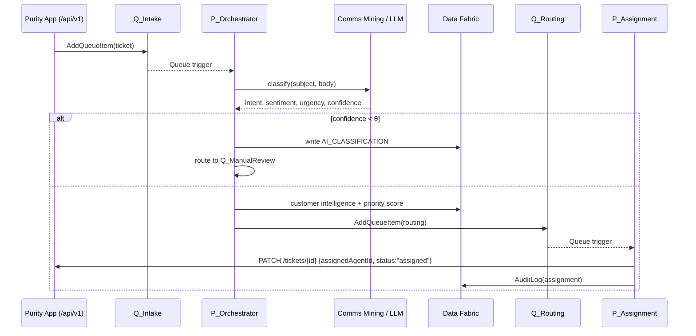
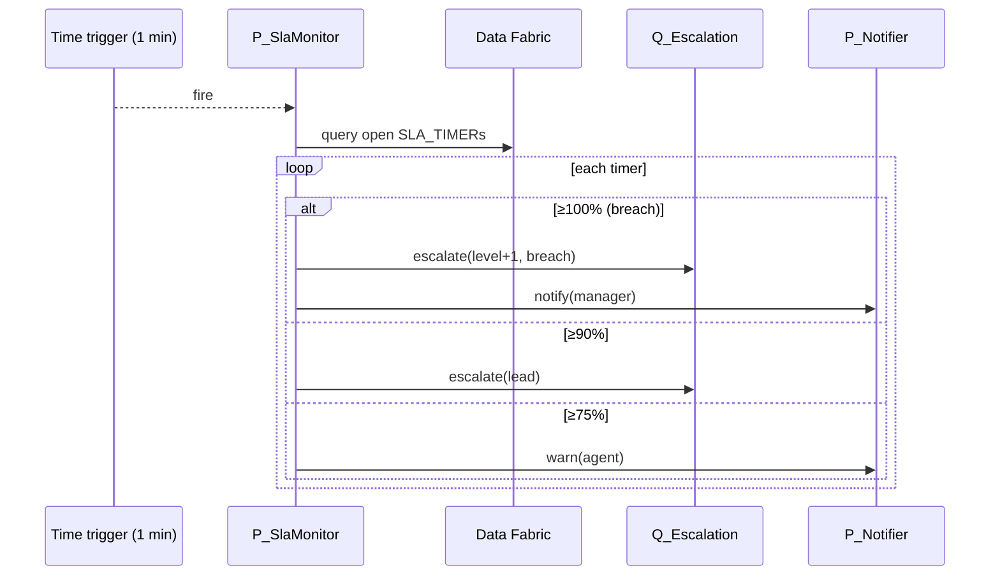
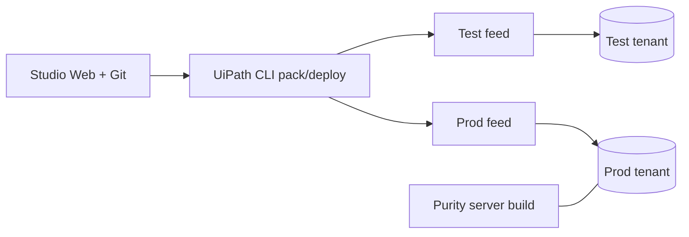

# Intelligent Support Orchestration Engine — UiPath Architecture

**Platform:** Purity Support · **Automation stack:** UiPath Automation Cloud (Studio Web, Orchestrator, Data Service/Data Fabric, Communications Mining, AI Center, Integration Service, Action Center)

This document designs the UiPath automation layer that acts as the **brain** of
the Purity Support platform. The Next.js app (this repo) is the **system of
record and UI**; UiPath is the **orchestration and intelligence engine**. They
integrate through two channels already built in this repo:

- **App → UiPath:** on ticket submit, the app writes to Data Fabric (SDK,
  `src/lib/server/uipath.ts`) and/or adds an Orchestrator queue item.
- **UiPath → App:** processes call the app's REST API (`/api/v1/tickets/{id}`
  PATCH for status/assignment, `POST /messages` for AI replies) so every
  automated decision is reflected in the customer UI.

---

## Table of contents

1. [Architecture principles](#1-architecture-principles)
2. [Process architecture (Studio Web)](#2-process-architecture-studio-web)
3. [Workflow hierarchy](#3-workflow-hierarchy)
4. [Master orchestration flow](#4-master-orchestration-flow)
5. [Queue architecture](#5-queue-architecture)
6. [Orchestrator architecture](#6-orchestrator-architecture)
7. [Data entities (Data Fabric)](#7-data-entities-data-fabric)
8. [REFramework structure](#8-reframework-structure)
9. [Variables & arguments design](#9-variables--arguments-design)
10. [Phase-by-phase design](#10-phase-by-phase-design)
11. [Sequence diagrams](#11-sequence-diagrams)
12. [AI integration architecture](#12-ai-integration-architecture)
13. [Exception-handling framework](#13-exception-handling-framework)
14. [Logging framework](#14-logging-framework)
15. [Security & compliance](#15-security--compliance)
16. [Deployment architecture](#16-deployment-architecture)
17. [Scalability](#17-scalability)

---

## 1. Architecture principles

| Principle | How it's applied |
| --- | --- |
| **Event-driven, queue-decoupled** | Every phase hands off via an Orchestrator queue. No long-running monoliths; each stage is independently retriable and scalable. |
| **Dispatcher / Performer split** | Channel *dispatchers* only normalize + enqueue. *Performers* do the heavy work. This is the REFramework "producer/consumer" pattern at platform scale. |
| **Idempotency** | Every queue item carries a `Reference` (the Ticket ID + phase). Re-processing a duplicate is a no-op. |
| **Human-in-the-loop by confidence** | AI decisions above a threshold auto-execute; below it, they route to Action Center for a human. |
| **System of record stays in the app** | UiPath never owns ticket truth; it reads/writes through `/api/v1` and Data Fabric so the UI and robots never diverge. |
| **Everything auditable** | Each decision writes an `AuditLog` Data Fabric record and a structured Orchestrator log with the Ticket ID as a Log Field. |

---

## 2. Process architecture (Studio Web)

Built as **many small processes** (not one giant workflow), each REFramework- or
state-machine-based, connected by queues. Three process classes:

- **Dispatchers** (one per channel) — thin, fast, high-frequency.
- **Performers** — REFramework consumers bound to a queue trigger.
- **Monitors** — time-triggered background scanners (SLA, incidents, predictive, analytics).



---

## 3. Workflow hierarchy

```
Purity.Orchestration/           (Solution / package group)
├── Dispatchers/
│   ├── P_Intake.WebForm
│   ├── P_Intake.LiveChat
│   ├── P_Intake.WhatsApp
│   ├── P_Intake.Email          (Email trigger / IMAP)
│   ├── P_Intake.Api            (webhook from app /api/v1)
│   ├── P_Intake.Mobile
│   ├── P_Intake.Voice          (STT → transcript)
│   └── P_Intake.Social
├── Core/
│   └── P_Orchestrator/         (REFramework)
│       ├── Main.xaml           (state machine)
│       ├── Framework/          (Init, GetTransaction, Process, End, SetTransactionStatus)
│       └── Business/
│           ├── AiUnderstanding.xaml     (Phase 2)
│           ├── CustomerIntelligence.xaml(Phase 3)
│           ├── PriorityEngine.xaml      (Phase 4)
│           ├── SlaPrediction.xaml       (Phase 6-predict)
│           ├── ResolutionRecommend.xaml (Phase 7)
│           └── RouteDecision.xaml       (Phase 5 pre-select)
├── Performers/
│   ├── P_Assignment            (Phase 5 execute)
│   ├── P_Escalation            (Phase 8)
│   ├── P_KnowledgeLearning     (Phase 11)
│   └── P_Notifier              (all channels out)
├── Monitors/
│   ├── P_SlaMonitor            (Phase 6, time trigger 1-5 min)
│   ├── P_IncidentCorrelation   (Phase 9, time trigger 5-10 min)
│   ├── P_PredictiveSupport     (Phase 10, hourly/daily)
│   └── P_Analytics             (Phase 12, daily/weekly/monthly)
└── Shared/                     (Library package, reusable activities)
    ├── Lib.ApiClient           (typed wrappers over /api/v1)
    ├── Lib.DataFabric          (Data Service CRUD helpers)
    ├── Lib.Ai                  (Comms Mining / AI Center / LLM calls)
    ├── Lib.Audit               (AuditLog writer + masking)
    └── Lib.Notify              (email/chat/WhatsApp/push senders)
```

Reusable logic ships as a **UiPath Library** (`Purity.Shared`) so every process
depends on the same tested `Lib.*` activities.

---

## 4. Master orchestration flow



Phase 10 (Predictive) runs **out-of-band** — it *creates* requests that re-enter
at Phase 1.

---

## 5. Queue architecture

| Queue | Producer | Consumer | SpecificContent (key fields) | Retry |
| --- | --- | --- | --- | --- |
| `Q_Intake` | Dispatchers, app webhook | `P_Orchestrator` | TicketId, Channel, RawPayload, CustomerRef | 2 |
| `Q_ManualReview` | `P_Orchestrator` | Action Center → human | TicketId, AiResult, Reason | 0 |
| `Q_Routing` | `P_Orchestrator` | `P_Assignment` | TicketId, PriorityScore, RequiredSkills, Language | 3 |
| `Q_Escalation` | Orchestrator/Monitors | `P_Escalation` | TicketId, Level, Trigger, Evidence | 2 |
| `Q_SLA_Actions` | `P_SlaMonitor` | `P_Notifier`/`P_Escalation` | TicketId, SlaType, Threshold, Action | 3 |
| `Q_Incident` | `P_IncidentCorrelation` | Ops process | IncidentId, Pattern, TicketIds[] | 1 |
| `Q_Knowledge` | closure trigger | `P_KnowledgeLearning` | TicketId, Resolution, Outcome, CSAT | 1 |
| `Q_Notifications` | any | `P_Notifier` | Channel, Recipient, Template, Payload | 5 |
| `Q_DeadLetter` | global error handler | on-call review | SourceQueue, Item, Error, Stack | 0 |

- **Queue triggers** start performers automatically when items arrive
  (min items = 1). **SLA prediction** sets Orchestrator **queue item deadlines**
  so overdue work surfaces natively.
- **Unique reference** = `{TicketId}:{Phase}` → Orchestrator rejects duplicates.
- Failed transactions after max retries are copied to `Q_DeadLetter` by the
  central error handler (§13).

---

## 6. Orchestrator architecture



- **Folders** isolate function + apply **RBAC** (§15). Environment separation
  via **tenants** (Dev / Test / Prod) or folder-per-env.
- **Modern folders** with **automatic robot allocation**; pools sized per queue
  throughput (§17).
- **Assets** hold all config not in `Config.xlsx`: `Api.BaseUrl`,
  `Api.Key` (Credential asset), `Ai.ConfidenceThreshold`, `Sla.*`, feature
  flags. Environment-specific values live in the folder's assets.
- **Action Center** hosts the manual-review and approval tasks (Phases 2, 7, 8).

---

## 7. Data entities (Data Fabric)

The app's `Ticket` entity (already defined) is extended with an
orchestration-owned schema. Created once in Data Service; records read/written by
processes (SDK or Data Service activities).

```mermaid
erDiagram
  CUSTOMER ||--o{ TICKET : raises
  AGENT ||--o{ TICKET : assigned
  TICKET ||--o{ AI_CLASSIFICATION : has
  TICKET ||--o{ PRIORITY_SCORE : scored
  TICKET ||--o{ ESCALATION : escalates
  TICKET ||--o{ SLA_TIMER : tracked
  TICKET ||--o{ AUDIT_LOG : records
  INCIDENT ||--o{ TICKET : correlates
  TICKET ||--o{ KNOWLEDGE_CANDIDATE : yields
  AGENT }o--o{ SKILL : has

  CUSTOMER { string CustomerId PK; string Tier; string Plan; number ContractValue; date RenewalDate; number LifetimeValue; number CsatAvg; int OpenTicketCount; int HealthScore }
  TICKET { string TicketId PK; string Subject; string Status; string Priority; bool Assigned; string Intent; string Sentiment; int UrgencyScore; int PriorityScore; string CustomerId FK; string AgentId FK; string IncidentId FK; datetime CreatedAt }
  AGENT { string AgentId PK; string Name; string[] Skills; string[] Languages; string TimeZone; number PerfRating; number SlaSuccessRate; int CurrentLoad; bool Available }
  SKILL { string SkillId PK; string Name; string Product }
  AI_CLASSIFICATION { string Id PK; string TicketId FK; string Intent; number SentimentScore; number UrgencyScore; number Confidence; string Model; datetime At }
  PRIORITY_SCORE { string Id PK; string TicketId FK; int Score; string Breakdown_JSON; datetime At }
  SLA_TIMER { string Id PK; string TicketId FK; string SlaType; datetime Target; string State }
  ESCALATION { string Id PK; string TicketId FK; int Level; string Trigger; string ActorTo; string Evidence; datetime At }
  INCIDENT { string IncidentId PK; string Pattern; string Status; int AffectedCount; string RootCauseQueue }
  KNOWLEDGE_CANDIDATE { string Id PK; string TicketId FK; string Recommendation; string Status }
  AUDIT_LOG { string Id PK; string TicketId FK; string Phase; string Action; string ActorType; string Details_JSON; datetime At }
```

---

## 8. REFramework structure

`P_Orchestrator` (and each performer) uses the REFramework state machine:



- **Initialize**: read `Config.xlsx` + Orchestrator assets, authenticate API
  client + Data Fabric SDK, verify connectivity (kill-switch asset check).
- **GetTransaction**: `Get Transaction Item` from the bound queue.
- **Process**: invoke the phase workflows in order; wrap each in Try/Catch.
  - **BusinessRuleException** (e.g. unknown category, no eligible agent) →
    `Set Transaction Status = Failed (Business)`, no retry, route to
    `Q_ManualReview` / `Q_Escalation`.
  - **System exception** (API/AI/DB down) → `Failed (System)`, auto-retry per
    queue policy, then `Q_DeadLetter`.
- **SetTransactionStatus / End**: write `AuditLog`, emit metrics, close.

---

## 9. Variables & arguments design

**REFramework `Config`** (Dictionary<String,Object>) from `Config.xlsx`:

| Sheet | Keys (examples) |
| --- | --- |
| Settings | `LogF_BusinessProcessName`, `OrchestratorQueueName`, `Api_BaseUrl`, `MaxRetryNumber` |
| Constants | `RetryNumberGetTransactionItem`, `RetryNumberSetTransactionStatus` |
| Assets | `Api_Key` (Credential), `Ai_ConfidenceThreshold`, `Sla_FirstResponseMins`, `VipTiers` |

**Queue item `SpecificContent`** (the canonical ticket envelope):

```jsonc
{
  "TicketId": "TCK-2051",
  "Channel": "web|chat|whatsapp|email|api|mobile|voice|social",
  "CustomerRef": "customer-123",
  "Subject": "…", "Description": "…",
  "Attachments": ["url1"], "Transcript": "…",
  "Phase": "Intake",
  "CorrelationId": "uuid"
}
```

**Workflow argument convention** (every `.xaml` in `Business/`):

| Direction | Naming | Example |
| --- | --- | --- |
| in | `in_*` | `in_TicketId`, `in_Config`, `in_ClassificationResult` |
| out | `out_*` | `out_PriorityScore`, `out_SelectedAgentId` |
| in/out | `io_*` | `io_TicketContext` (a typed object passed down the pipeline) |

`io_TicketContext` is a strongly-typed record (custom `TicketContext` class in the
Shared library) accumulating each phase's output, so phases stay pure functions:
`Process(in ctx) → out ctx`.

---

## 10. Phase-by-phase design

> Each phase: **inputs → logic (activities) → outputs → decision → exceptions.**

**Phase 1 — Intake.** *In:* raw channel payload. *Logic:* validate schema
(BusinessException on invalid); dedupe (query Data Fabric by hash of
subject+customer+window, or app duplicate endpoint); mint `TicketId` (app
`POST /api/v1/tickets` is the ID authority); persist raw payload; `AddQueueItem`
→ `Q_Intake`. *Out:* TicketId, Channel, CustomerId, Timestamp. *Exceptions:*
Invalid Data / Missing Customer → Manual Review; Duplicate → link + stop; API
failure → retry then DeadLetter.

**Phase 2 — AI Understanding.** *In:* subject, description, attachments,
transcript. *Logic:* **UiPath Communications Mining** for intent + sentiment +
urgency (its native support taxonomy); **Document Understanding** on attachments;
fallback **LLM** via Integration Service for edge cases. *Out:* Intent,
SentimentScore, UrgencyScore, Confidence → `AI_CLASSIFICATION`. *Decision:*
`Confidence < Ai_ConfidenceThreshold` → `Q_ManualReview`.

**Phase 3 — Customer Intelligence.** *In:* CustomerId. *Logic:* fetch tier,
plan, contract value, renewal, LTV, past tickets/escalations, CSAT, open count
(CRM connector + Data Fabric). Compute **Health Score 0-100** (weighted). *Out:*
Health Score + VIP flag. *Decision:* VIP tiers get a priority boost in Phase 4.

**Phase 4 — Dynamic Priority Engine.** `PriorityScore (1-100) =
w1·CustomerValue + w2·Sentiment + w3·Urgency + w4·SlaRisk + w5·OpenIncidents +
w6·HistoricalComplaints`, clamped, bucketed Low/Medium/High/Critical. Weights are
**Assets** (tunable without redeploy). Persist full breakdown →
`PRIORITY_SCORE` (audit).

**Phase 5 — Smart Routing.** Score each candidate agent on skill match, product
expertise, workload, availability, time zone, language, performance,
SLA-success. Pick max; tie-break on lowest load. *No eligible agent* → BusinessException →
`Q_Escalation`. Write assignment back via **`PATCH /api/v1/tickets/{id}`**
(`assignedAgentId`) so the UI updates.

**Phase 6 — SLA Management.** On intake, create `SLA_TIMER`s (first-response,
resolution, escalation) with targets from policy assets. `P_SlaMonitor`
(time trigger) scans open timers: **75% → warn agent**, **90% → escalate +
notify lead**, **100% → breach + reassign**, each via `Q_SLA_Actions`/
`Q_Escalation`. Orchestrator **queue deadlines** back this natively.

**Phase 7 — Resolution Recommendation.** Retrieve from KB + resolved tickets +
internal docs + resolution DB (vector/keyword search via Integration Service or
AI Center). LLM drafts a response + recommended actions with a confidence.
*High* → attach suggestion / **`POST /api/v1/tickets/{id}/messages`** as an
agent-draft; *Low* → specialist via `Q_Escalation`.

**Phase 8 — Escalation Engine.** Triggers: angry sentiment, VIP, legal/security/
fraud keywords, SLA-breach risk, multiple reopens. Ladder **L1 Agent → L2 Senior
→ L3 Lead → L4 Manager → L5 Director**. Each step writes an `ESCALATION` record
+ `AuditLog` and notifies via `Q_Notifications`. Approvals routed through Action
Center where human sign-off is required.

**Phase 9 — Incident Correlation.** `P_IncidentCorrelation` clusters recent
tickets by similarity (embedding/keyword) — e.g. many "login failure" /
"payment outage". On threshold: create `INCIDENT`, link `TICKET.IncidentId`,
notify ops (`Q_Notifications`), open a root-cause queue. *Out:* IncidentId,
affected customers, RCA queue.

**Phase 10 — Predictive Support.** Monitors external signals (failed payments,
API error rates, login failures, usage drops, outages) + inactivity (e.g. 14
days) → **generates proactive tickets** into `Q_Intake` and notifies Customer
Success. Turns support from reactive to proactive.

**Phase 11 — Knowledge Learning.** On closure (trigger → `Q_Knowledge`), analyze
issue/resolution/outcome/feedback and classify into **KB article / FAQ / AI
training dataset / automation opportunity** → `KNOWLEDGE_CANDIDATE` queued for
review (Action Center). Closes the improvement loop.

**Phase 12 — Analytics.** `P_Analytics` (daily/weekly/monthly triggers)
aggregates volume, resolution time, SLA compliance, CSAT, escalations, agent
performance, incident trends, **AI resolution success rate** → writes to a
reporting store / Insights dataset and emails leadership. Feeds Phase-4 weight
tuning.

---

## 11. Sequence diagrams

**Intake → orchestration → assignment**



**SLA monitor → escalation**



---

## 12. AI integration architecture

| Capability | UiPath product | Fallback |
| --- | --- | --- |
| Intent + sentiment + urgency on text/chat/email | **Communications Mining** (train a support taxonomy) | LLM via Integration Service |
| Attachment/data extraction | **Document Understanding** | — |
| Custom priority / churn ML | **AI Center** (ML Skills, versioned) | rules engine (assets) |
| Resolution draft, summaries, KB search | **Integration Service** LLM connector (Azure OpenAI / OpenAI) + vector search | canned templates |
| Human fallback | **Action Center** tasks | — |

- All model calls go through `Lib.Ai` with **timeout + retry + circuit breaker**;
  on AI outage the pipeline **degrades gracefully** to rules + manual review
  (never blocks intake).
- Every inference stores **model id, version, confidence** in `AI_CLASSIFICATION`
  for explainability and drift monitoring.
- **Confidence thresholds** are assets → tune the automation/human boundary
  without redeploying.

---

## 13. Exception-handling framework

Centralized in the Shared library (`Lib.ErrorHandler`):

| Scenario | Strategy |
| --- | --- |
| API failure (`/api/v1`) | Retry (exponential backoff, from asset) → circuit-break → `Q_DeadLetter` |
| AI service failure | Timeout → fallback to rules/manual review; log degraded mode |
| Missing data | BusinessException → `Q_ManualReview` (no retry) |
| Routing failure | BusinessException → `Q_Escalation` |
| Data Fabric failure | Retry → cache-and-forward; alert on-call |
| Notification failure | `Q_Notifications` retry ×5 → alternate channel |

- **Two exception classes:** `BusinessRuleException` (do not retry; human path)
  vs `System.Exception` (retry; reset state). Enforced in REFramework `Process`.
- **Every failure** writes `AuditLog` + an Orchestrator **Alert** (severity by
  queue) and, past max retries, a `Q_DeadLetter` item with full context + stack.
- **Global kill-switch** asset pauses intake consumers during major outages.

---

## 14. Logging framework

- **Structured logs** via `Add Log Fields`: `TicketId`, `Channel`, `Phase`,
  `CorrelationId`, `CustomerTier`, `PriorityScore`, `Decision`, `Confidence`.
- **Levels:** Trace (dev), Info (phase enter/exit + decision), Warn (fallbacks,
  SLA 75%), Error (system), Fatal (kill-switch).
- **Sinks:** Orchestrator logs → **Insights** / Elasticsearch / Splunk; plus an
  immutable **`AuditLog`** Data Fabric record per business decision.
- **Correlation:** one `CorrelationId` spans all phases/queues for a ticket, so a
  request is traceable end-to-end across processes.

---

## 15. Security & compliance

- **RBAC** via Orchestrator **folders + roles**: dispatchers, performers,
  monitors, and admins each get least-privilege access; agents only see Action
  Center tasks for their folder.
- **Credentials** in Orchestrator **Credential Assets** / integrated credential
  store (CyberArk/Azure Key Vault) — never in `Config.xlsx` or code.
- **Encryption** in transit (HTTPS to `/api/v1` + UiPath) and at rest (Data
  Fabric managed encryption).
- **Sensitive-data masking:** `Lib.Audit` redacts PII/PCI (card numbers, secrets)
  before any log/audit write via regex + field allow-list.
- **Compliance logging:** immutable `AuditLog` (who/what/when/why) satisfies
  SOC 2 / GDPR access-trail requirements; retention policy per entity.
- **External Application / PAT** scoped to only the resources needed (Data
  Service, Queues, Orchestrator API).

---

## 16. Deployment architecture

- **Environments:** Dev → Test → Prod as separate tenants (or folder-per-env);
  promote packages through Orchestrator feeds.
- **CI/CD:** Studio Web → source control → **UiPath CLI** in the pipeline
  (`pack` + `deploy`) → publish to the target Orchestrator feed → update
  processes + triggers via API. Config/assets per environment.
- **Release safety:** blue/green by publishing a new process version and
  swapping the trigger; queue items drain from the old version first.
- **App side:** the Next.js server build (this repo, `server-api-poc`) deploys
  alongside; its `/api/v1` + Data Fabric SDK are the integration surface.



---

## 17. Scalability

- **Throughput:** sizing target = *thousands/day*. At 5,000 tickets/day with a
  ~10s orchestration path, ~0.6 concurrent performers suffice; provision **≥3**
  for burst + HA. Scale each performer pool independently by its queue depth.
- **Elastic robots:** Automation Cloud **serverless / auto-scaling** unattended
  pools keyed to queue backlog (SLA-driven).
- **Decoupling:** because every phase is its own queue+process, a slow stage
  (e.g. AI) throttles only its consumer, not intake — no head-of-line blocking.
- **Idempotent + at-least-once:** safe to scale consumers horizontally; unique
  references prevent double-processing.
- **Backpressure:** queue SLA/deadline + max-in-flight assets protect downstream
  APIs; kill-switch + DeadLetter contain incidents.
- **Data:** Data Fabric for operational records; offload analytics aggregates to
  a warehouse/Insights to keep transactional entities lean.

---

### How this maps to what's already built

- `POST /api/v1/tickets` is the **Phase 1** ID authority and the app-side
  producer (adds to `Q_Intake` / writes Data Fabric via `src/lib/server/uipath.ts`).
- `PATCH /api/v1/tickets/{id}` and `POST …/messages` are how **Phases 5, 7, 8**
  write decisions back so the customer UI reflects them.
- The Data Fabric `Ticket` entity is the seed of the entity model in §7 — the
  remaining entities extend it.
- Tickets are created **Unassigned** by the app; the orchestration engine is what
  assigns, prioritizes, and escalates them.
